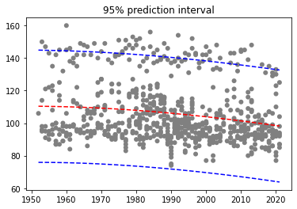
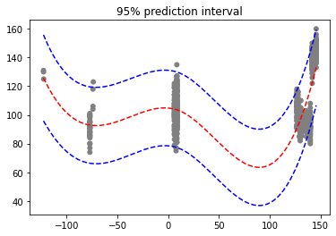
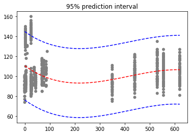
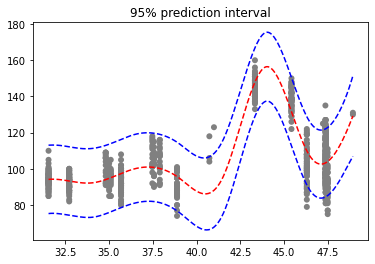
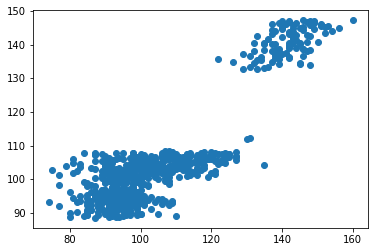

To predict the blooming day of year for Vancouver for years between 2023 and 2031, the GAM is considered. The rationale is to extract as much as information from given small number of features using cubic natural spline function. We first would show how the GAM for bloom_doy with each of individual features look like and show how well they perform comapred to the simple linear model


```python
import numpy as np
import pandas as pd
import os
os.chdir('./data')
import scipy
import matplotlib.pyplot as plt
df = pd.read_csv('./lee.csv')
y = df.bloom_doy
```


```python
from pygam import LinearGAM, s, l, te, f
import pygam
```


```python
# suppress 'FutureWarning' messages
import warnings
warnings.filterwarnings('ignore')
```

### GAM for year


```python
X = df[['year']].to_numpy()

gam = LinearGAM(n_splines=4).gridsearch(X, y)

XX = gam.generate_X_grid(term=0, n=500)

plt.plot(XX, gam.predict(XX), 'r--')
plt.plot(XX, gam.prediction_intervals(XX, width=.95), color='b', ls='--')

plt.scatter(X, y, facecolor='gray', edgecolors='none')
plt.title('95% prediction interval');
```

    100% (11 of 11) |########################| Elapsed Time: 0:00:00 Time:  0:00:00


    

    


```python
gam.summary()
```

    LinearGAM                                                                                                 
    =============================================== ==========================================================
    Distribution:                        NormalDist Effective DoF:                                      2.6984
    Link Function:                     IdentityLink Log Likelihood:                                 -4781.4772
    Number of Samples:                          720 AIC:                                             9570.3512
                                                    AICc:                                            9570.3998
                                                    GCV:                                              307.0884
                                                    Scale:                                            305.0175
                                                    Pseudo R-Squared:                                   0.0399
    ==========================================================================================================
    Feature Function                  Lambda               Rank         EDoF         P > x        Sig. Code   
    ================================= ==================== ============ ============ ============ ============
    s(0)                              [0.2512]             4            2.7          1.11e-16     ***         
    intercept                                              1            0.0          1.11e-16     ***         
    ==========================================================================================================
    Significance codes:  0 '***' 0.001 '**' 0.01 '*' 0.05 '.' 0.1 ' ' 1
    
    WARNING: Fitting splines and a linear function to a feature introduces a model identifiability problem
             which can cause p-values to appear significant when they are not.
    
    WARNING: p-values calculated in this manner behave correctly for un-penalized models or models with
             known smoothing parameters, but when smoothing parameters have been estimated, the p-values
             are typically lower than they should be, meaning that the tests reject the null too readily.


### GAM for longitude


```python
X = df[['long']].to_numpy()

gam = LinearGAM(n_splines=5).gridsearch(X, y)

XX = gam.generate_X_grid(term=0, n=500)

plt.plot(XX, gam.predict(XX), 'r--')
plt.plot(XX, gam.prediction_intervals(XX, width=.95), color='b', ls='--')

plt.scatter(X, y, facecolor='gray', edgecolors='none')
plt.title('95% prediction interval');
```

    100% (11 of 11) |########################| Elapsed Time: 0:00:00 Time:  0:00:00


    

    


```python
gam.summary()
```

    LinearGAM                                                                                                 
    =============================================== ==========================================================
    Distribution:                        NormalDist Effective DoF:                                      4.9189
    Link Function:                     IdentityLink Log Likelihood:                                 -4398.6377
    Number of Samples:                          720 AIC:                                             8809.1134
                                                    AICc:                                            8809.2282
                                                    GCV:                                              181.2492
                                                    Scale:                                            179.0216
                                                    Pseudo R-Squared:                                   0.4383
    ==========================================================================================================
    Feature Function                  Lambda               Rank         EDoF         P > x        Sig. Code   
    ================================= ==================== ============ ============ ============ ============
    s(0)                              [0.001]              5            4.9          1.11e-16     ***         
    intercept                                              1            0.0          1.11e-16     ***         
    ==========================================================================================================
    Significance codes:  0 '***' 0.001 '**' 0.01 '*' 0.05 '.' 0.1 ' ' 1
    
    WARNING: Fitting splines and a linear function to a feature introduces a model identifiability problem
             which can cause p-values to appear significant when they are not.
    
    WARNING: p-values calculated in this manner behave correctly for un-penalized models or models with
             known smoothing parameters, but when smoothing parameters have been estimated, the p-values
             are typically lower than they should be, meaning that the tests reject the null too readily.


### GAM for altitude


```python
X = df[['alt']].to_numpy()

gam = LinearGAM(n_splines=4).gridsearch(X, y)

XX = gam.generate_X_grid(term=0, n=500)

plt.plot(XX, gam.predict(XX), 'r--')
plt.plot(XX, gam.prediction_intervals(XX, width=.95), color='b', ls='--')

plt.scatter(X, y, facecolor='gray', edgecolors='none')
plt.title('95% prediction interval');
```

    100% (11 of 11) |########################| Elapsed Time: 0:00:00 Time:  0:00:00


    

    


```python
gam.summary()
```

    LinearGAM                                                                                                 
    =============================================== ==========================================================
    Distribution:                        NormalDist Effective DoF:                                      3.9204
    Link Function:                     IdentityLink Log Likelihood:                                 -4780.2494
    Number of Samples:                          720 AIC:                                             9570.3396
                                                    AICc:                                            9570.4212
                                                    GCV:                                              307.5102
                                                    Scale:                                            304.4978
                                                    Pseudo R-Squared:                                   0.0432
    ==========================================================================================================
    Feature Function                  Lambda               Rank         EDoF         P > x        Sig. Code   
    ================================= ==================== ============ ============ ============ ============
    s(0)                              [0.001]              4            3.9          1.11e-16     ***         
    intercept                                              1            0.0          1.11e-16     ***         
    ==========================================================================================================
    Significance codes:  0 '***' 0.001 '**' 0.01 '*' 0.05 '.' 0.1 ' ' 1
    
    WARNING: Fitting splines and a linear function to a feature introduces a model identifiability problem
             which can cause p-values to appear significant when they are not.
    
    WARNING: p-values calculated in this manner behave correctly for un-penalized models or models with
             known smoothing parameters, but when smoothing parameters have been estimated, the p-values
             are typically lower than they should be, meaning that the tests reject the null too readily.


### GAM for latitude


```python
X = df[['lat']].to_numpy()

gam = LinearGAM(n_splines=10).gridsearch(X, y)

XX = gam.generate_X_grid(term=0, n=500)

plt.plot(XX, gam.predict(XX), 'r--')
plt.plot(XX, gam.prediction_intervals(XX, width=.95), color='b', ls='--')

plt.scatter(X, y, facecolor='gray', edgecolors='none')
plt.title('95% prediction interval');
```

    100% (11 of 11) |########################| Elapsed Time: 0:00:00 Time:  0:00:00


    

    


```python
gam.summary()
```

    LinearGAM                                                                                                 
    =============================================== ==========================================================
    Distribution:                        NormalDist Effective DoF:                                      9.7293
    Link Function:                     IdentityLink Log Likelihood:                                 -3914.6298
    Number of Samples:                          720 AIC:                                             7850.7181
                                                    AICc:                                            7851.0735
                                                    GCV:                                               93.4316
                                                    Scale:                                             91.1619
                                                    Pseudo R-Squared:                                   0.7159
    ==========================================================================================================
    Feature Function                  Lambda               Rank         EDoF         P > x        Sig. Code   
    ================================= ==================== ============ ============ ============ ============
    s(0)                              [0.004]              10           9.7          1.11e-16     ***         
    intercept                                              1            0.0          1.11e-16     ***         
    ==========================================================================================================
    Significance codes:  0 '***' 0.001 '**' 0.01 '*' 0.05 '.' 0.1 ' ' 1
    
    WARNING: Fitting splines and a linear function to a feature introduces a model identifiability problem
             which can cause p-values to appear significant when they are not.
    
    WARNING: p-values calculated in this manner behave correctly for un-penalized models or models with
             known smoothing parameters, but when smoothing parameters have been estimated, the p-values
             are typically lower than they should be, meaning that the tests reject the null too readily.


### Final GAM model


```python
X = df[['year','lat','long','alt']].to_numpy()
gam = LinearGAM(s(0, n_splines=4) + s(1, n_splines=10) + s(2, n_splines = 5) + s(3, n_splines = 4))
gam.fit(X, y)

```


    LinearGAM(callbacks=[Deviance(), Diffs()], fit_intercept=True, 
       max_iter=100, scale=None, 
       terms=s(0) + s(1) + s(2) + s(3) + intercept, tol=0.0001, 
       verbose=False)


```python
gam.summary()
```

    LinearGAM                                                                                                 
    =============================================== ==========================================================
    Distribution:                        NormalDist Effective DoF:                                     10.3197
    Link Function:                     IdentityLink Log Likelihood:                                  -3722.181
    Number of Samples:                          720 AIC:                                             7467.0015
                                                    AICc:                                            7467.3956
                                                    GCV:                                               71.5064
                                                    Scale:                                             69.6639
                                                    Pseudo R-Squared:                                   0.7831
    ==========================================================================================================
    Feature Function                  Lambda               Rank         EDoF         P > x        Sig. Code   
    ================================= ==================== ============ ============ ============ ============
    s(0)                              [0.6]                4            2.5          1.62e-11     ***         
    s(1)                              [0.6]                10           6.4          1.11e-16     ***         
    s(2)                              [0.6]                5            0.9          1.11e-16     ***         
    s(3)                              [0.6]                4            0.6          2.15e-14     ***         
    intercept                                              1            0.0          1.11e-16     ***         
    ==========================================================================================================
    Significance codes:  0 '***' 0.001 '**' 0.01 '*' 0.05 '.' 0.1 ' ' 1
    
    WARNING: Fitting splines and a linear function to a feature introduces a model identifiability problem
             which can cause p-values to appear significant when they are not.
    
    WARNING: p-values calculated in this manner behave correctly for un-penalized models or models with
             known smoothing parameters, but when smoothing parameters have been estimated, the p-values
             are typically lower than they should be, meaning that the tests reject the null too readily.


### y vs. prediction scatter plot


```python
# y vs predict of y plot
plt.scatter(y, gam.predict(X))
```


    <matplotlib.collections.PathCollection at 0x7f64688d7670>


    

    


### Finding MSE and compare the performance with the simple linear model


```python
from sklearn.model_selection import train_test_split
X_train, X_test, y_train, y_test = train_test_split(X, y, test_size=0.3)
```


```python
gam = LinearGAM(s(0, n_splines=4) + s(1, n_splines=10) + s(2, n_splines = 5) + s(3, n_splines = 4))
gam.fit(X_train, y_train)
```


    LinearGAM(callbacks=[Deviance(), Diffs()], fit_intercept=True, 
       max_iter=100, scale=None, 
       terms=s(0) + s(1) + s(2) + s(3) + intercept, tol=0.0001, 
       verbose=False)


```python
MSE = []
for i in range(20):
    X_train, X_test, y_train, y_test = train_test_split(X, y, test_size=0.3)
    gam = LinearGAM(s(0, n_splines=4) + s(1, n_splines=10) + s(2, n_splines = 5) + s(3, n_splines = 4))
    gam.fit(X_train, y_train)
    mse= np.sqrt(((gam.predict(X_test)-y_test)**2).sum()/X_test.shape[0])
    MSE.append(mse)
```

#### mean of RMSE and its variance


```python
np.mean(MSE), np.var(MSE)
```


    (8.403409696782528, 0.16685889113835406)


#### Simple linear model


```python
from sklearn.linear_model import LinearRegression
```


```python
regressor = LinearRegression()
```


```python
X = df[['year','lat','long','alt']].copy()
X['year.sq'] = X['year']*X['year']
X = X.to_numpy()
```


```python
from sklearn.metrics import make_scorer
from sklearn.metrics import mean_squared_error
from sklearn.model_selection import ShuffleSplit
from sklearn.tree import DecisionTreeRegressor
from sklearn.model_selection import cross_val_score
from sklearn.tree import DecisionTreeRegressor
from sklearn.model_selection import cross_val_score

mse = make_scorer(mean_squared_error, greater_is_better = False )
cv = ShuffleSplit(n_splits=20, test_size=0.3)
scorelin = cross_val_score(regressor, X, y, cv = cv, scoring = mse)
```


```python
np.sqrt(abs(scorelin)).mean(), np.sqrt(abs(scorelin)).var()
```


    (10.416621817302417, 0.19770509194178032)


### GAM performs better than linear regression
