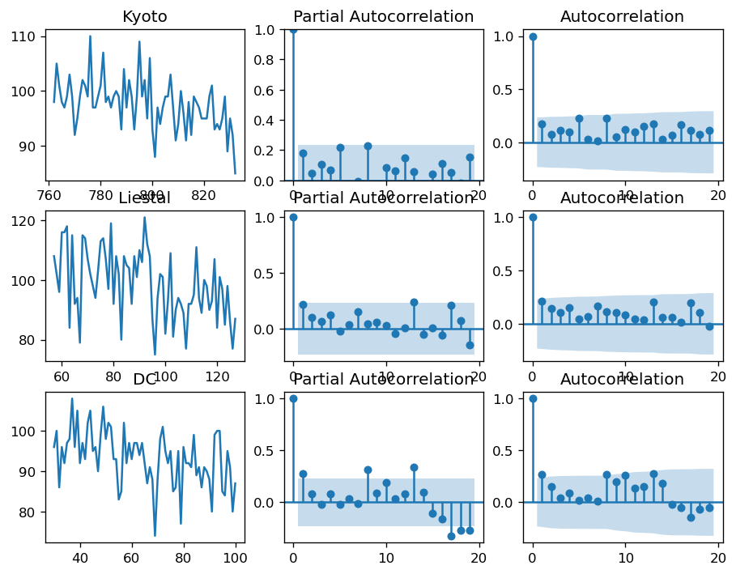
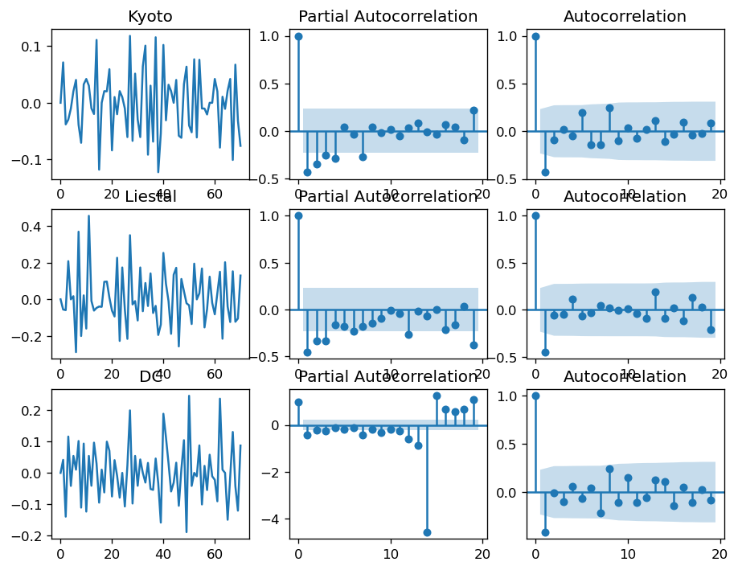
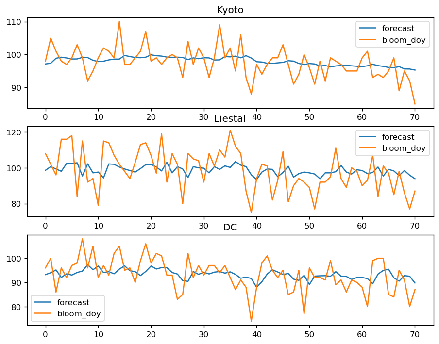
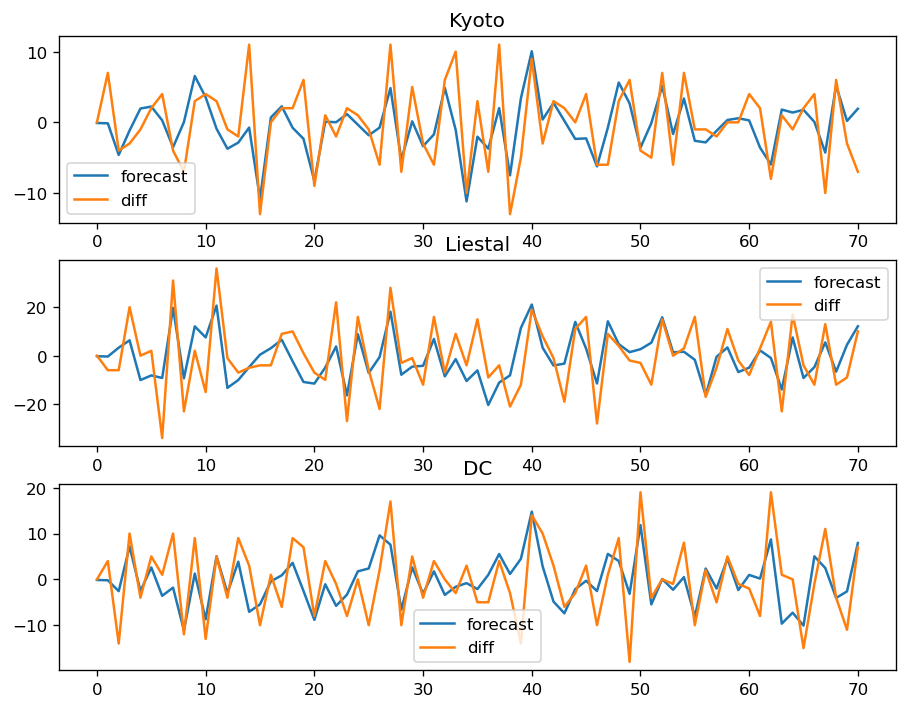
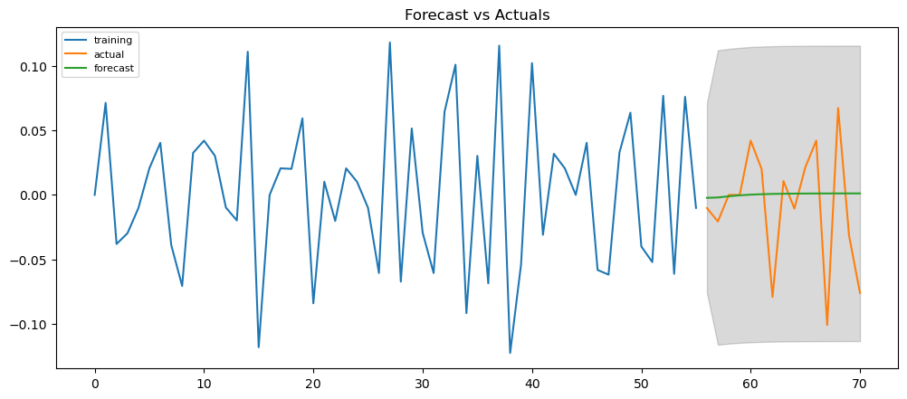

Model : Time Series (ARIMA)
================


```python
import os
os.chdir('./data')
```


```python
import pandas as pd
import numpy as np
import scipy
import matplotlib.pyplot as plt
import seaborn as sns
```

### Data Imports (Core datasets)


```python
kyoto = pd.read_csv('kyoto.csv')
```


```python
kyoto.head()
```


<div>
<style scoped>
    .dataframe tbody tr th:only-of-type {
        vertical-align: middle;
    }

    .dataframe tbody tr th {
        vertical-align: top;
    }

    .dataframe thead th {
        text-align: right;
    }
</style>
<table border="1" class="dataframe">
  <thead>
    <tr style="text-align: right;">
      <th></th>
      <th>location</th>
      <th>lat</th>
      <th>long</th>
      <th>alt</th>
      <th>year</th>
      <th>bloom_date</th>
      <th>bloom_doy</th>
    </tr>
  </thead>
  <tbody>
    <tr>
      <th>0</th>
      <td>kyoto</td>
      <td>35.011983</td>
      <td>135.676114</td>
      <td>44</td>
      <td>812</td>
      <td>0812-04-01</td>
      <td>92</td>
    </tr>
    <tr>
      <th>1</th>
      <td>kyoto</td>
      <td>35.011983</td>
      <td>135.676114</td>
      <td>44</td>
      <td>815</td>
      <td>0815-04-15</td>
      <td>105</td>
    </tr>
    <tr>
      <th>2</th>
      <td>kyoto</td>
      <td>35.011983</td>
      <td>135.676114</td>
      <td>44</td>
      <td>831</td>
      <td>0831-04-06</td>
      <td>96</td>
    </tr>
    <tr>
      <th>3</th>
      <td>kyoto</td>
      <td>35.011983</td>
      <td>135.676114</td>
      <td>44</td>
      <td>851</td>
      <td>0851-04-18</td>
      <td>108</td>
    </tr>
    <tr>
      <th>4</th>
      <td>kyoto</td>
      <td>35.011983</td>
      <td>135.676114</td>
      <td>44</td>
      <td>853</td>
      <td>0853-04-14</td>
      <td>104</td>
    </tr>
  </tbody>
</table>
</div>


```python
kyoto = kyoto.query('year > 1950').reset_index(drop = True)
```


```python
# I am also interested in the change
kyoto['change'] = kyoto.bloom_doy.pct_change(1).fillna(0)
kyoto['diff'] = kyoto.bloom_doy.diff(1).fillna(0)
```


```python
kyoto.head()
```


<div>
<style scoped>
    .dataframe tbody tr th:only-of-type {
        vertical-align: middle;
    }

    .dataframe tbody tr th {
        vertical-align: top;
    }

    .dataframe thead th {
        text-align: right;
    }
</style>
<table border="1" class="dataframe">
  <thead>
    <tr style="text-align: right;">
      <th></th>
      <th>location</th>
      <th>lat</th>
      <th>long</th>
      <th>alt</th>
      <th>year</th>
      <th>bloom_date</th>
      <th>bloom_doy</th>
      <th>change</th>
      <th>diff</th>
    </tr>
  </thead>
  <tbody>
    <tr>
      <th>0</th>
      <td>kyoto</td>
      <td>35.011983</td>
      <td>135.676114</td>
      <td>44</td>
      <td>1951</td>
      <td>1951-04-08</td>
      <td>98</td>
      <td>0.000000</td>
      <td>0.0</td>
    </tr>
    <tr>
      <th>1</th>
      <td>kyoto</td>
      <td>35.011983</td>
      <td>135.676114</td>
      <td>44</td>
      <td>1952</td>
      <td>1952-04-14</td>
      <td>105</td>
      <td>0.071429</td>
      <td>7.0</td>
    </tr>
    <tr>
      <th>2</th>
      <td>kyoto</td>
      <td>35.011983</td>
      <td>135.676114</td>
      <td>44</td>
      <td>1953</td>
      <td>1953-04-11</td>
      <td>101</td>
      <td>-0.038095</td>
      <td>-4.0</td>
    </tr>
    <tr>
      <th>3</th>
      <td>kyoto</td>
      <td>35.011983</td>
      <td>135.676114</td>
      <td>44</td>
      <td>1954</td>
      <td>1954-04-08</td>
      <td>98</td>
      <td>-0.029703</td>
      <td>-3.0</td>
    </tr>
    <tr>
      <th>4</th>
      <td>kyoto</td>
      <td>35.011983</td>
      <td>135.676114</td>
      <td>44</td>
      <td>1955</td>
      <td>1955-04-07</td>
      <td>97</td>
      <td>-0.010204</td>
      <td>-1.0</td>
    </tr>
  </tbody>
</table>
</div>


```python
liestal = pd.read_csv('liestal.csv')
```


```python
liestal.head()
```


<div>
<style scoped>
    .dataframe tbody tr th:only-of-type {
        vertical-align: middle;
    }

    .dataframe tbody tr th {
        vertical-align: top;
    }

    .dataframe thead th {
        text-align: right;
    }
</style>
<table border="1" class="dataframe">
  <thead>
    <tr style="text-align: right;">
      <th></th>
      <th>location</th>
      <th>lat</th>
      <th>long</th>
      <th>alt</th>
      <th>year</th>
      <th>bloom_date</th>
      <th>bloom_doy</th>
    </tr>
  </thead>
  <tbody>
    <tr>
      <th>0</th>
      <td>liestal</td>
      <td>47.4814</td>
      <td>7.730519</td>
      <td>350</td>
      <td>1894</td>
      <td>1894-04-16</td>
      <td>106</td>
    </tr>
    <tr>
      <th>1</th>
      <td>liestal</td>
      <td>47.4814</td>
      <td>7.730519</td>
      <td>350</td>
      <td>1895</td>
      <td>1895-04-17</td>
      <td>107</td>
    </tr>
    <tr>
      <th>2</th>
      <td>liestal</td>
      <td>47.4814</td>
      <td>7.730519</td>
      <td>350</td>
      <td>1896</td>
      <td>1896-04-16</td>
      <td>107</td>
    </tr>
    <tr>
      <th>3</th>
      <td>liestal</td>
      <td>47.4814</td>
      <td>7.730519</td>
      <td>350</td>
      <td>1897</td>
      <td>1897-03-27</td>
      <td>86</td>
    </tr>
    <tr>
      <th>4</th>
      <td>liestal</td>
      <td>47.4814</td>
      <td>7.730519</td>
      <td>350</td>
      <td>1898</td>
      <td>1898-04-16</td>
      <td>106</td>
    </tr>
  </tbody>
</table>
</div>


```python
liestal = liestal.query('year>1950').reset_index(drop = True)
# I am also interested in the change
liestal['change'] = liestal.bloom_doy.pct_change(1).fillna(0)
liestal['diff'] = liestal.bloom_doy.diff(1).fillna(0)
```


```python

```


```python
dc = pd.read_csv('washingtondc.csv')
```


```python
dc.head()
```


<div>
<style scoped>
    .dataframe tbody tr th:only-of-type {
        vertical-align: middle;
    }

    .dataframe tbody tr th {
        vertical-align: top;
    }

    .dataframe thead th {
        text-align: right;
    }
</style>
<table border="1" class="dataframe">
  <thead>
    <tr style="text-align: right;">
      <th></th>
      <th>location</th>
      <th>lat</th>
      <th>long</th>
      <th>alt</th>
      <th>year</th>
      <th>bloom_date</th>
      <th>bloom_doy</th>
    </tr>
  </thead>
  <tbody>
    <tr>
      <th>0</th>
      <td>washingtondc</td>
      <td>38.88535</td>
      <td>-77.038628</td>
      <td>0</td>
      <td>1921</td>
      <td>1921-03-20</td>
      <td>79</td>
    </tr>
    <tr>
      <th>1</th>
      <td>washingtondc</td>
      <td>38.88535</td>
      <td>-77.038628</td>
      <td>0</td>
      <td>1922</td>
      <td>1922-04-07</td>
      <td>97</td>
    </tr>
    <tr>
      <th>2</th>
      <td>washingtondc</td>
      <td>38.88535</td>
      <td>-77.038628</td>
      <td>0</td>
      <td>1923</td>
      <td>1923-04-09</td>
      <td>99</td>
    </tr>
    <tr>
      <th>3</th>
      <td>washingtondc</td>
      <td>38.88535</td>
      <td>-77.038628</td>
      <td>0</td>
      <td>1924</td>
      <td>1924-04-13</td>
      <td>104</td>
    </tr>
    <tr>
      <th>4</th>
      <td>washingtondc</td>
      <td>38.88535</td>
      <td>-77.038628</td>
      <td>0</td>
      <td>1925</td>
      <td>1925-03-27</td>
      <td>86</td>
    </tr>
  </tbody>
</table>
</div>


```python
dc = dc.query('year>1950').reset_index(drop = True)
# I am also interested in the change
dc['change'] = dc.bloom_doy.pct_change(1).fillna(0)
dc['diff'] = dc.bloom_doy.diff(1).fillna(0)
```


```python
fig, axes = plt.subplots(3, 3)
kyoto.loc[:, ['year','bloom_doy']].plot.line(x = 'year', y = 'bloom_doy', ax = axes[0, 0])
liestal.loc[:, ['year','bloom_doy']].plot.line(x = 'year', y = 'bloom_doy', ax = axes[1, 0], color = 'orange')
dc.loc[:, ['year','bloom_doy']].plot.line(x = 'year', y = 'bloom_doy', ax = axes[2, 0], color = 'green')
# change
kyoto.loc[:, ['year','change']].plot.line(x = 'year', y = 'change', ax = axes[0, 1])
liestal.loc[:, ['year','change']].plot.line(x = 'year', y = 'change', ax = axes[1, 1], color = 'orange')
dc.loc[:, ['year','change']].plot.line(x = 'year', y = 'change', ax = axes[2, 1], color = 'green')
# diff
kyoto.loc[:, ['year','diff']].plot.line(x = 'year', y = 'diff', ax = axes[0, 2])
liestal.loc[:, ['year','diff']].plot.line(x = 'year', y = 'diff', ax = axes[1, 2], color = 'orange')
dc.loc[:, ['year','diff']].plot.line(x = 'year', y = 'diff', ax = axes[2, 2], color = 'green')

```


    <AxesSubplot:xlabel='year'>


    

    


# Model 1: ARIMA Models for each of them


```python
from statsmodels.tsa.stattools import adfuller
```


```python
result = adfuller(kyoto.bloom_doy)
print(f'p-value : {result[1].round(5)}' )
result = adfuller(kyoto['diff'])
print(f'p-value : {result[1].round(5)}' )
result = adfuller(kyoto.change)
print(f'p-value : {result[1].round(5)}' )
```

    p-value : 0.0
    p-value : 0.0
    p-value : 1e-05


```python
result = adfuller(liestal.bloom_doy)
print(f'p-value : {result[1].round(5)}' )
result = adfuller(liestal['diff'])
print(f'p-value : {result[1].round(5)}' )
result = adfuller(liestal.change)
print(f'p-value : {result[1].round(5)}' )
```

    p-value : 0.0
    p-value : 0.0
    p-value : 0.0


```python
result = adfuller(dc.bloom_doy)
print(f'p-value : {result[1].round(5)}' )
result = adfuller(dc['diff'])
print(f'p-value : {result[1].round(5)}' )
result = adfuller(dc.change)
print(f'p-value : {result[1].round(5)}' )
```

    p-value : 0.0
    p-value : 3e-05
    p-value : 3e-05


#### Finding 1: The ADF test indicates that all of the time series are stationary
=> We will move forward to find p and q for the ARIMA model


```python
from statsmodels.graphics.tsaplots import plot_acf, plot_pacf
plt.rcParams.update({'figure.figsize':(9,7), 'figure.dpi':120})

```

#### Bloom Day


```python
fig, axes = plt.subplots(3, 3)

# Kyoto
axes[0, 0].plot(kyoto.bloom_doy)
axes[0, 0].set_title('Kyoto')
axes[0, 1].set(ylim=(0,1))
plot_pacf(kyoto.bloom_doy, ax=axes[0, 1]);
plot_acf(kyoto.bloom_doy, ax=axes[0, 2]);
#Liestal
axes[1, 0].plot(liestal.bloom_doy)
axes[1, 0].set_title('Liestal')
axes[0, 1].set(ylim=(0,1))
plot_pacf(liestal.bloom_doy, ax=axes[1, 1]);
plot_acf(liestal.bloom_doy, ax=axes[1, 2]);

#DC
axes[2, 0].plot(dc.bloom_doy)
axes[2, 0].set_title('DC')
axes[0, 1].set(ylim=(0,1))
plot_pacf(dc.bloom_doy, ax=axes[2, 1]);
plot_acf(dc.bloom_doy, ax=axes[2, 2]);


```


    

    


This is quite ambiguous, because for Tokyo and Liestal, it may make sense to set p = 1, while for DC, setting p = 1 would be little controversial; However, to make all of them consistent, I will set p = 1. The same goes for the q parameter; we will set q as 1

### Differences


```python
fig, axes = plt.subplots(3, 3)

# Kyoto
axes[0, 0].plot(kyoto['diff'])
axes[0, 0].set_title('Kyoto')
plot_pacf(kyoto['diff'], ax=axes[0, 1]);
plot_acf(kyoto['diff'], ax=axes[0, 2]);
#Liestal
axes[1, 0].plot(liestal['diff'])
axes[1, 0].set_title('Liestal')
plot_pacf(liestal['diff'], ax=axes[1, 1]);
plot_acf(liestal['diff'], ax=axes[1, 2]);

#DC
axes[2, 0].plot(dc['diff'])
axes[2, 0].set_title('DC')
plot_pacf(dc['diff'], ax=axes[2, 1]);
plot_acf(dc['diff'], ax=axes[2, 2]);

```

    /home/leepark/anaconda3/lib/python3.8/site-packages/statsmodels/regression/linear_model.py:1434: RuntimeWarning: invalid value encountered in sqrt
      return rho, np.sqrt(sigmasq)


    

    


We may set p = 2, and q = 2 as well when it comes to the time series model on differences

### Change


```python
fig, axes = plt.subplots(3, 3)

# Kyoto
axes[0, 0].plot(kyoto['change'])
axes[0, 0].set_title('Kyoto')
plot_pacf(kyoto['change'], ax=axes[0, 1]);
plot_acf(kyoto['change'], ax=axes[0, 2]);
#Liestal
axes[1, 0].plot(liestal['change'])
axes[1, 0].set_title('Liestal')
plot_pacf(liestal['change'], ax=axes[1, 1]);
plot_acf(liestal['change'], ax=axes[1, 2]);

#DC
axes[2, 0].plot(dc['change'])
axes[2, 0].set_title('DC')
plot_pacf(dc['change'], ax=axes[2, 1]);
plot_acf(dc['change'], ax=axes[2, 2]);

```

    /home/leepark/anaconda3/lib/python3.8/site-packages/statsmodels/regression/linear_model.py:1434: RuntimeWarning: invalid value encountered in sqrt
      return rho, np.sqrt(sigmasq)


    

    


p = 3, q = 2?

## Fitting ARIMA

### Bloom DOY : ARIMA (1, 0, 1)


```python
from statsmodels.tsa.arima_model import ARIMA
```


```python
model1 = ARIMA(kyoto.bloom_doy, order=(1,0,1))
model_fit = model1.fit()
print(model_fit.summary())
model2 = ARIMA(liestal.bloom_doy, order=(1,0,0))
model_fit2 = model2.fit()
print(model_fit2.summary())
model3 = ARIMA(dc.bloom_doy, order=(1,0,1))
model_fit3 = model3.fit()
print(model_fit3.summary())
```

    /home/leepark/anaconda3/lib/python3.8/site-packages/statsmodels/tsa/arima_model.py:472: FutureWarning: 
    statsmodels.tsa.arima_model.ARMA and statsmodels.tsa.arima_model.ARIMA have
    been deprecated in favor of statsmodels.tsa.arima.model.ARIMA (note the .
    between arima and model) and
    statsmodels.tsa.SARIMAX. These will be removed after the 0.12 release.
    
    statsmodels.tsa.arima.model.ARIMA makes use of the statespace framework and
    is both well tested and maintained.
    
    To silence this warning and continue using ARMA and ARIMA until they are
    removed, use:
    
    import warnings
    warnings.filterwarnings('ignore', 'statsmodels.tsa.arima_model.ARMA',
                            FutureWarning)
    warnings.filterwarnings('ignore', 'statsmodels.tsa.arima_model.ARIMA',
                            FutureWarning)
    
      warnings.warn(ARIMA_DEPRECATION_WARN, FutureWarning)


                                  ARMA Model Results                              
    ==============================================================================
    Dep. Variable:              bloom_doy   No. Observations:                   71
    Model:                     ARMA(1, 1)   Log Likelihood                -204.253
    Method:                       css-mle   S.D. of innovations              4.278
    Date:                Sat, 19 Feb 2022   AIC                            416.507
    Time:                        15:00:50   BIC                            425.557
    Sample:                             0   HQIC                           420.106
                                                                                  
    ===================================================================================
                          coef    std err          z      P>|z|      [0.025      0.975]
    -----------------------------------------------------------------------------------
    const              97.1437      1.874     51.826      0.000      93.470     100.818
    ar.L1.bloom_doy     0.9757      0.035     28.081      0.000       0.908       1.044
    ma.L1.bloom_doy    -0.8776      0.066    -13.241      0.000      -1.007      -0.748
                                        Roots                                    
    =============================================================================
                      Real          Imaginary           Modulus         Frequency
    -----------------------------------------------------------------------------
    AR.1            1.0249           +0.0000j            1.0249            0.0000
    MA.1            1.1395           +0.0000j            1.1395            0.0000
    -----------------------------------------------------------------------------
                                  ARMA Model Results                              
    ==============================================================================
    Dep. Variable:              bloom_doy   No. Observations:                   71
    Model:                     ARMA(1, 0)   Log Likelihood                -271.671
    Method:                       css-mle   S.D. of innovations             11.101
    Date:                Sat, 19 Feb 2022   AIC                            549.341
    Time:                        15:00:50   BIC                            556.129
    Sample:                             0   HQIC                           552.040
                                                                                  
    ===================================================================================
                          coef    std err          z      P>|z|      [0.025      0.975]
    -----------------------------------------------------------------------------------
    const              98.6110      1.677     58.789      0.000      95.323     101.899
    ar.L1.bloom_doy     0.2176      0.116      1.871      0.061      -0.010       0.446
                                        Roots                                    
    =============================================================================
                      Real          Imaginary           Modulus         Frequency
    -----------------------------------------------------------------------------
    AR.1            4.5954           +0.0000j            4.5954            0.0000
    -----------------------------------------------------------------------------
                                  ARMA Model Results                              
    ==============================================================================
    Dep. Variable:              bloom_doy   No. Observations:                   71
    Model:                     ARMA(1, 1)   Log Likelihood                -233.204
    Method:                       css-mle   S.D. of innovations              6.456
    Date:                Sat, 19 Feb 2022   AIC                            474.407
    Time:                        15:00:50   BIC                            483.458
    Sample:                             0   HQIC                           478.006
                                                                                  
    ===================================================================================
                          coef    std err          z      P>|z|      [0.025      0.975]
    -----------------------------------------------------------------------------------
    const              93.2298      1.191     78.283      0.000      90.896      95.564
    ar.L1.bloom_doy     0.5676      0.376      1.509      0.131      -0.170       1.305
    ma.L1.bloom_doy    -0.3213      0.434     -0.741      0.459      -1.171       0.528
                                        Roots                                    
    =============================================================================
                      Real          Imaginary           Modulus         Frequency
    -----------------------------------------------------------------------------
    AR.1            1.7619           +0.0000j            1.7619            0.0000
    MA.1            3.1120           +0.0000j            3.1120            0.0000
    -----------------------------------------------------------------------------


    /home/leepark/anaconda3/lib/python3.8/site-packages/statsmodels/tsa/arima_model.py:472: FutureWarning: 
    statsmodels.tsa.arima_model.ARMA and statsmodels.tsa.arima_model.ARIMA have
    been deprecated in favor of statsmodels.tsa.arima.model.ARIMA (note the .
    between arima and model) and
    statsmodels.tsa.SARIMAX. These will be removed after the 0.12 release.
    
    statsmodels.tsa.arima.model.ARIMA makes use of the statespace framework and
    is both well tested and maintained.
    
    To silence this warning and continue using ARMA and ARIMA until they are
    removed, use:
    
    import warnings
    warnings.filterwarnings('ignore', 'statsmodels.tsa.arima_model.ARMA',
                            FutureWarning)
    warnings.filterwarnings('ignore', 'statsmodels.tsa.arima_model.ARIMA',
                            FutureWarning)
    
      warnings.warn(ARIMA_DEPRECATION_WARN, FutureWarning)
    /home/leepark/anaconda3/lib/python3.8/site-packages/statsmodels/tsa/arima_model.py:472: FutureWarning: 
    statsmodels.tsa.arima_model.ARMA and statsmodels.tsa.arima_model.ARIMA have
    been deprecated in favor of statsmodels.tsa.arima.model.ARIMA (note the .
    between arima and model) and
    statsmodels.tsa.SARIMAX. These will be removed after the 0.12 release.
    
    statsmodels.tsa.arima.model.ARIMA makes use of the statespace framework and
    is both well tested and maintained.
    
    To silence this warning and continue using ARMA and ARIMA until they are
    removed, use:
    
    import warnings
    warnings.filterwarnings('ignore', 'statsmodels.tsa.arima_model.ARMA',
                            FutureWarning)
    warnings.filterwarnings('ignore', 'statsmodels.tsa.arima_model.ARIMA',
                            FutureWarning)
    
      warnings.warn(ARIMA_DEPRECATION_WARN, FutureWarning)


```python
fig, axes = plt.subplots(3, 1)

model_fit.plot_predict(dynamic=False, ax=axes[0]);
model_fit2.plot_predict(dynamic=False, ax=axes[1]);
model_fit3.plot_predict(dynamic=False, ax=axes[2]);
axes[0].set_title('Kyoto')
axes[1].set_title('Liestal')
axes[2].set_title('DC')
```


    Text(0.5, 1.0, 'DC')


    

    


### DIFF : ARIMA (2, 0, 2)


```python
model1 = ARIMA(kyoto['diff'], order=(2,0,2))
model_fit = model1.fit()
print(model_fit.summary())
model2 = ARIMA(liestal['diff'], order=(2,0,2))
model_fit2 = model2.fit()
print(model_fit2.summary())
model3 = ARIMA(dc['diff'], order=(2,0,2))
model_fit3 = model3.fit()
print(model_fit3.summary())
```

    /home/leepark/anaconda3/lib/python3.8/site-packages/statsmodels/tsa/arima_model.py:472: FutureWarning: 
    statsmodels.tsa.arima_model.ARMA and statsmodels.tsa.arima_model.ARIMA have
    been deprecated in favor of statsmodels.tsa.arima.model.ARIMA (note the .
    between arima and model) and
    statsmodels.tsa.SARIMAX. These will be removed after the 0.12 release.
    
    statsmodels.tsa.arima.model.ARIMA makes use of the statespace framework and
    is both well tested and maintained.
    
    To silence this warning and continue using ARMA and ARIMA until they are
    removed, use:
    
    import warnings
    warnings.filterwarnings('ignore', 'statsmodels.tsa.arima_model.ARMA',
                            FutureWarning)
    warnings.filterwarnings('ignore', 'statsmodels.tsa.arima_model.ARIMA',
                            FutureWarning)
    
      warnings.warn(ARIMA_DEPRECATION_WARN, FutureWarning)


                                  ARMA Model Results                              
    ==============================================================================
    Dep. Variable:                   diff   No. Observations:                   71
    Model:                     ARMA(2, 2)   Log Likelihood                -201.784
    Method:                       css-mle   S.D. of innovations              4.024
    Date:                Sat, 19 Feb 2022   AIC                            415.568
    Time:                        14:56:37   BIC                            429.144
    Sample:                             0   HQIC                           420.966
                                                                                  
    ==============================================================================
                     coef    std err          z      P>|z|      [0.025      0.975]
    ------------------------------------------------------------------------------
    const         -0.0955      0.022     -4.326      0.000      -0.139      -0.052
    ar.L1.diff    -0.5398      0.616     -0.876      0.381      -1.748       0.668
    ar.L2.diff    -0.0777      0.135     -0.576      0.564      -0.342       0.187
    ma.L1.diff    -0.4410      0.611     -0.722      0.470      -1.639       0.757
    ma.L2.diff    -0.5590      0.610     -0.917      0.359      -1.754       0.636
                                        Roots                                    
    =============================================================================
                      Real          Imaginary           Modulus         Frequency
    -----------------------------------------------------------------------------
    AR.1           -3.4737           -0.8967j            3.5875           -0.4598
    AR.2           -3.4737           +0.8967j            3.5875            0.4598
    MA.1            1.0000           +0.0000j            1.0000            0.0000
    MA.2           -1.7891           +0.0000j            1.7891            0.5000
    -----------------------------------------------------------------------------


    /home/leepark/anaconda3/lib/python3.8/site-packages/statsmodels/tsa/arima_model.py:472: FutureWarning: 
    statsmodels.tsa.arima_model.ARMA and statsmodels.tsa.arima_model.ARIMA have
    been deprecated in favor of statsmodels.tsa.arima.model.ARIMA (note the .
    between arima and model) and
    statsmodels.tsa.SARIMAX. These will be removed after the 0.12 release.
    
    statsmodels.tsa.arima.model.ARIMA makes use of the statespace framework and
    is both well tested and maintained.
    
    To silence this warning and continue using ARMA and ARIMA until they are
    removed, use:
    
    import warnings
    warnings.filterwarnings('ignore', 'statsmodels.tsa.arima_model.ARMA',
                            FutureWarning)
    warnings.filterwarnings('ignore', 'statsmodels.tsa.arima_model.ARIMA',
                            FutureWarning)
    
      warnings.warn(ARIMA_DEPRECATION_WARN, FutureWarning)
    /home/leepark/anaconda3/lib/python3.8/site-packages/statsmodels/base/model.py:547: HessianInversionWarning: Inverting hessian failed, no bse or cov_params available
      warnings.warn('Inverting hessian failed, no bse or cov_params '


                                  ARMA Model Results                              
    ==============================================================================
    Dep. Variable:                   diff   No. Observations:                   71
    Model:                     ARMA(2, 2)   Log Likelihood                -267.951
    Method:                       css-mle   S.D. of innovations             10.236
    Date:                Sat, 19 Feb 2022   AIC                            547.902
    Time:                        14:56:37   BIC                            561.478
    Sample:                             0   HQIC                           553.300
                                                                                  
    ==============================================================================
                     coef    std err          z      P>|z|      [0.025      0.975]
    ------------------------------------------------------------------------------
    const         -0.2417      0.063     -3.861      0.000      -0.364      -0.119
    ar.L1.diff    -0.6359      0.763     -0.833      0.405      -2.132       0.860
    ar.L2.diff     0.0673      0.121      0.557      0.577      -0.169       0.304
    ma.L1.diff    -0.3018      0.757     -0.399      0.690      -1.785       1.181
    ma.L2.diff    -0.6982      0.756     -0.923      0.356      -2.180       0.784
                                        Roots                                    
    =============================================================================
                      Real          Imaginary           Modulus         Frequency
    -----------------------------------------------------------------------------
    AR.1           -1.3731           +0.0000j            1.3731            0.5000
    AR.2           10.8256           +0.0000j           10.8256            0.0000
    MA.1            1.0000           +0.0000j            1.0000            0.0000
    MA.2           -1.4322           +0.0000j            1.4322            0.5000
    -----------------------------------------------------------------------------


    /home/leepark/anaconda3/lib/python3.8/site-packages/statsmodels/tsa/arima_model.py:472: FutureWarning: 
    statsmodels.tsa.arima_model.ARMA and statsmodels.tsa.arima_model.ARIMA have
    been deprecated in favor of statsmodels.tsa.arima.model.ARIMA (note the .
    between arima and model) and
    statsmodels.tsa.SARIMAX. These will be removed after the 0.12 release.
    
    statsmodels.tsa.arima.model.ARIMA makes use of the statespace framework and
    is both well tested and maintained.
    
    To silence this warning and continue using ARMA and ARIMA until they are
    removed, use:
    
    import warnings
    warnings.filterwarnings('ignore', 'statsmodels.tsa.arima_model.ARMA',
                            FutureWarning)
    warnings.filterwarnings('ignore', 'statsmodels.tsa.arima_model.ARIMA',
                            FutureWarning)
    
      warnings.warn(ARIMA_DEPRECATION_WARN, FutureWarning)
    /home/leepark/anaconda3/lib/python3.8/site-packages/statsmodels/base/model.py:547: HessianInversionWarning: Inverting hessian failed, no bse or cov_params available
      warnings.warn('Inverting hessian failed, no bse or cov_params '


                                  ARMA Model Results                              
    ==============================================================================
    Dep. Variable:                   diff   No. Observations:                   71
    Model:                     ARMA(2, 2)   Log Likelihood                -229.938
    Method:                       css-mle   S.D. of innovations              5.995
    Date:                Sat, 19 Feb 2022   AIC                            471.876
    Time:                        14:56:38   BIC                            485.452
    Sample:                             0   HQIC                           477.275
                                                                                  
    ==============================================================================
                     coef    std err          z      P>|z|      [0.025      0.975]
    ------------------------------------------------------------------------------
    const         -0.1360      0.041     -3.308      0.001      -0.217      -0.055
    ar.L1.diff    -0.7512      0.143     -5.240      0.000      -1.032      -0.470
    ar.L2.diff     0.1952      0.120      1.621      0.105      -0.041       0.431
    ma.L1.diff    -0.0990      0.097     -1.017      0.309      -0.290       0.092
    ma.L2.diff    -0.9010      0.096     -9.396      0.000      -1.089      -0.713
                                        Roots                                    
    =============================================================================
                      Real          Imaginary           Modulus         Frequency
    -----------------------------------------------------------------------------
    AR.1           -1.0466           +0.0000j            1.0466            0.5000
    AR.2            4.8957           +0.0000j            4.8957            0.0000
    MA.1            1.0000           +0.0000j            1.0000            0.0000
    MA.2           -1.1099           +0.0000j            1.1099            0.5000
    -----------------------------------------------------------------------------


```python
fig, axes = plt.subplots(3, 1)

model_fit.plot_predict(dynamic=False, ax=axes[0]);
model_fit2.plot_predict(dynamic=False, ax=axes[1]);
model_fit3.plot_predict(dynamic=False, ax=axes[2]);
axes[0].set_title('Kyoto')
axes[1].set_title('Liestal')
axes[2].set_title('DC')
```


    Text(0.5, 1.0, 'DC')


    

    


### Change


```python
model1 = ARIMA(kyoto['change'], order=(2,0,2))
model_fit = model1.fit()
print(model_fit.summary())
model2 = ARIMA(liestal['change'], order=(2,0,2))
model_fit2 = model2.fit()
print(model_fit2.summary())
model3 = ARIMA(dc['change'], order=(2,0,2))
model_fit3 = model3.fit()
print(model_fit3.summary())
```

    /home/leepark/anaconda3/lib/python3.8/site-packages/statsmodels/tsa/arima_model.py:472: FutureWarning: 
    statsmodels.tsa.arima_model.ARMA and statsmodels.tsa.arima_model.ARIMA have
    been deprecated in favor of statsmodels.tsa.arima.model.ARIMA (note the .
    between arima and model) and
    statsmodels.tsa.SARIMAX. These will be removed after the 0.12 release.
    
    statsmodels.tsa.arima.model.ARIMA makes use of the statespace framework and
    is both well tested and maintained.
    
    To silence this warning and continue using ARMA and ARIMA until they are
    removed, use:
    
    import warnings
    warnings.filterwarnings('ignore', 'statsmodels.tsa.arima_model.ARMA',
                            FutureWarning)
    warnings.filterwarnings('ignore', 'statsmodels.tsa.arima_model.ARIMA',
                            FutureWarning)
    
      warnings.warn(ARIMA_DEPRECATION_WARN, FutureWarning)
    /home/leepark/anaconda3/lib/python3.8/site-packages/statsmodels/tsa/tsatools.py:701: RuntimeWarning: overflow encountered in exp
      newparams = ((1-np.exp(-params))/(1+np.exp(-params))).copy()
    /home/leepark/anaconda3/lib/python3.8/site-packages/statsmodels/tsa/tsatools.py:701: RuntimeWarning: invalid value encountered in true_divide
      newparams = ((1-np.exp(-params))/(1+np.exp(-params))).copy()
    /home/leepark/anaconda3/lib/python3.8/site-packages/statsmodels/tsa/tsatools.py:702: RuntimeWarning: overflow encountered in exp
      tmp = ((1-np.exp(-params))/(1+np.exp(-params))).copy()
    /home/leepark/anaconda3/lib/python3.8/site-packages/statsmodels/tsa/tsatools.py:702: RuntimeWarning: invalid value encountered in true_divide
      tmp = ((1-np.exp(-params))/(1+np.exp(-params))).copy()
    /home/leepark/anaconda3/lib/python3.8/site-packages/statsmodels/base/model.py:547: HessianInversionWarning: Inverting hessian failed, no bse or cov_params available
      warnings.warn('Inverting hessian failed, no bse or cov_params '
    /home/leepark/anaconda3/lib/python3.8/site-packages/statsmodels/tsa/arima_model.py:472: FutureWarning: 
    statsmodels.tsa.arima_model.ARMA and statsmodels.tsa.arima_model.ARIMA have
    been deprecated in favor of statsmodels.tsa.arima.model.ARIMA (note the .
    between arima and model) and
    statsmodels.tsa.SARIMAX. These will be removed after the 0.12 release.
    
    statsmodels.tsa.arima.model.ARIMA makes use of the statespace framework and
    is both well tested and maintained.
    
    To silence this warning and continue using ARMA and ARIMA until they are
    removed, use:
    
    import warnings
    warnings.filterwarnings('ignore', 'statsmodels.tsa.arima_model.ARMA',
                            FutureWarning)
    warnings.filterwarnings('ignore', 'statsmodels.tsa.arima_model.ARIMA',
                            FutureWarning)
    
      warnings.warn(ARIMA_DEPRECATION_WARN, FutureWarning)


                                  ARMA Model Results                              
    ==============================================================================
    Dep. Variable:                 change   No. Observations:                   71
    Model:                     ARMA(2, 2)   Log Likelihood                 123.901
    Method:                       css-mle   S.D. of innovations              0.041
    Date:                Sat, 19 Feb 2022   AIC                           -235.802
    Time:                        15:02:59   BIC                           -222.226
    Sample:                             0   HQIC                          -230.404
                                                                                  
    ================================================================================
                       coef    std err          z      P>|z|      [0.025      0.975]
    --------------------------------------------------------------------------------
    const            0.0008      0.000      3.517      0.000       0.000       0.001
    ar.L1.change    -0.5699      0.476     -1.196      0.232      -1.504       0.364
    ar.L2.change    -0.0821      0.134     -0.612      0.541      -0.345       0.181
    ma.L1.change    -0.4060      0.469     -0.866      0.387      -1.325       0.513
    ma.L2.change    -0.5940      0.466     -1.274      0.203      -1.508       0.320
                                        Roots                                    
    =============================================================================
                      Real          Imaginary           Modulus         Frequency
    -----------------------------------------------------------------------------
    AR.1           -3.4718           -0.3600j            3.4904           -0.4836
    AR.2           -3.4718           +0.3600j            3.4904            0.4836
    MA.1            1.0000           +0.0000j            1.0000            0.0000
    MA.2           -1.6835           +0.0000j            1.6835            0.5000
    -----------------------------------------------------------------------------


    /home/leepark/anaconda3/lib/python3.8/site-packages/statsmodels/tsa/tsatools.py:701: RuntimeWarning: overflow encountered in exp
      newparams = ((1-np.exp(-params))/(1+np.exp(-params))).copy()
    /home/leepark/anaconda3/lib/python3.8/site-packages/statsmodels/tsa/tsatools.py:701: RuntimeWarning: invalid value encountered in true_divide
      newparams = ((1-np.exp(-params))/(1+np.exp(-params))).copy()
    /home/leepark/anaconda3/lib/python3.8/site-packages/statsmodels/tsa/tsatools.py:702: RuntimeWarning: overflow encountered in exp
      tmp = ((1-np.exp(-params))/(1+np.exp(-params))).copy()
    /home/leepark/anaconda3/lib/python3.8/site-packages/statsmodels/tsa/tsatools.py:702: RuntimeWarning: invalid value encountered in true_divide
      tmp = ((1-np.exp(-params))/(1+np.exp(-params))).copy()


                                  ARMA Model Results                              
    ==============================================================================
    Dep. Variable:                 change   No. Observations:                   71
    Model:                     ARMA(2, 2)   Log Likelihood                  53.180
    Method:                       css-mle   S.D. of innovations              0.113
    Date:                Sat, 19 Feb 2022   AIC                            -94.360
    Time:                        15:03:00   BIC                            -80.784
    Sample:                             0   HQIC                           -88.961
                                                                                  
    ================================================================================
                       coef    std err          z      P>|z|      [0.025      0.975]
    --------------------------------------------------------------------------------
    const            0.0085      0.002      4.943      0.000       0.005       0.012
    ar.L1.change     0.3709      1.280      0.290      0.772      -2.137       2.879
    ar.L2.change    -0.0844      0.152     -0.556      0.579      -0.382       0.213
    ma.L1.change    -1.2201      1.278     -0.955      0.340      -3.725       1.285
    ma.L2.change     0.3010      1.164      0.259      0.796      -1.981       2.583
                                        Roots                                    
    =============================================================================
                      Real          Imaginary           Modulus         Frequency
    -----------------------------------------------------------------------------
    AR.1            2.1963           -2.6494j            3.4414           -0.1398
    AR.2            2.1963           +2.6494j            3.4414            0.1398
    MA.1            1.1403           +0.0000j            1.1403            0.0000
    MA.2            2.9138           +0.0000j            2.9138            0.0000
    -----------------------------------------------------------------------------


    /home/leepark/anaconda3/lib/python3.8/site-packages/statsmodels/tsa/arima_model.py:472: FutureWarning: 
    statsmodels.tsa.arima_model.ARMA and statsmodels.tsa.arima_model.ARIMA have
    been deprecated in favor of statsmodels.tsa.arima.model.ARIMA (note the .
    between arima and model) and
    statsmodels.tsa.SARIMAX. These will be removed after the 0.12 release.
    
    statsmodels.tsa.arima.model.ARIMA makes use of the statespace framework and
    is both well tested and maintained.
    
    To silence this warning and continue using ARMA and ARIMA until they are
    removed, use:
    
    import warnings
    warnings.filterwarnings('ignore', 'statsmodels.tsa.arima_model.ARMA',
                            FutureWarning)
    warnings.filterwarnings('ignore', 'statsmodels.tsa.arima_model.ARIMA',
                            FutureWarning)
    
      warnings.warn(ARIMA_DEPRECATION_WARN, FutureWarning)


                                  ARMA Model Results                              
    ==============================================================================
    Dep. Variable:                 change   No. Observations:                   71
    Model:                     ARMA(2, 2)   Log Likelihood                  87.591
    Method:                       css-mle   S.D. of innovations              0.069
    Date:                Sat, 19 Feb 2022   AIC                           -163.183
    Time:                        15:03:00   BIC                           -149.606
    Sample:                             0   HQIC                          -157.784
                                                                                  
    ================================================================================
                       coef    std err          z      P>|z|      [0.025      0.975]
    --------------------------------------------------------------------------------
    const            0.0025      0.001      4.851      0.000       0.001       0.003
    ar.L1.change    -0.6896      0.138     -4.980      0.000      -0.961      -0.418
    ar.L2.change     0.2565      0.118      2.178      0.029       0.026       0.487
    ma.L1.change    -0.0989      0.096     -1.026      0.305      -0.288       0.090
    ma.L2.change    -0.9011      0.094     -9.540      0.000      -1.086      -0.716
                                        Roots                                    
    =============================================================================
                      Real          Imaginary           Modulus         Frequency
    -----------------------------------------------------------------------------
    AR.1           -1.0444           +0.0000j            1.0444            0.5000
    AR.2            3.7330           +0.0000j            3.7330            0.0000
    MA.1            1.0000           +0.0000j            1.0000            0.0000
    MA.2           -1.1098           +0.0000j            1.1098            0.5000
    -----------------------------------------------------------------------------


```python
fig, axes = plt.subplots(3, 1)

model_fit.plot_predict(dynamic=False, ax=axes[0]);
model_fit2.plot_predict(dynamic=False, ax=axes[1]);
model_fit3.plot_predict(dynamic=False, ax=axes[2]);
axes[0].set_title('Kyoto')
axes[1].set_title('Liestal')
axes[2].set_title('DC')
```


    Text(0.5, 1.0, 'DC')


    

    


### I want to see their performance on the last 15 years given they do not exist in the train dataset


```python
value = kyoto.change
train = value[:-15]
test = value[-15:]
```


```python
# Create Training and Test
value = kyoto.change
train = value[:-15]
test = value[-15:]
# Build Model
model = ARIMA(train, order=(2, 0, 2))  
fitted = model.fit(disp=-1)  
# Forecast
fc, se, conf = fitted.forecast(15, alpha=0.05)  # 95% conf
# Make as pandas series
fc_series = pd.Series(fc, index=test.index)
lower_series = pd.Series(conf[:, 0], index=test.index)
upper_series = pd.Series(conf[:, 1], index=test.index)
# Plot
plt.figure(figsize=(12,5), dpi=100)
plt.plot(train, label='training')
plt.plot(test, label='actual')
plt.plot(fc_series, label='forecast')
plt.fill_between(lower_series.index, lower_series, upper_series, 
                 color='k', alpha=.15)
plt.title('Forecast vs Actuals')
plt.legend(loc='upper left', fontsize=8)
plt.show()
```

    /home/leepark/anaconda3/lib/python3.8/site-packages/statsmodels/tsa/arima_model.py:472: FutureWarning: 
    statsmodels.tsa.arima_model.ARMA and statsmodels.tsa.arima_model.ARIMA have
    been deprecated in favor of statsmodels.tsa.arima.model.ARIMA (note the .
    between arima and model) and
    statsmodels.tsa.SARIMAX. These will be removed after the 0.12 release.
    
    statsmodels.tsa.arima.model.ARIMA makes use of the statespace framework and
    is both well tested and maintained.
    
    To silence this warning and continue using ARMA and ARIMA until they are
    removed, use:
    
    import warnings
    warnings.filterwarnings('ignore', 'statsmodels.tsa.arima_model.ARMA',
                            FutureWarning)
    warnings.filterwarnings('ignore', 'statsmodels.tsa.arima_model.ARIMA',
                            FutureWarning)
    
      warnings.warn(ARIMA_DEPRECATION_WARN, FutureWarning)
    /home/leepark/anaconda3/lib/python3.8/site-packages/statsmodels/base/model.py:547: HessianInversionWarning: Inverting hessian failed, no bse or cov_params available
      warnings.warn('Inverting hessian failed, no bse or cov_params '


    

    


It is interesting to see that the prediction doesn't really do well on predicting; it tells me that other information must be considered to predict the bloom doy.
 
